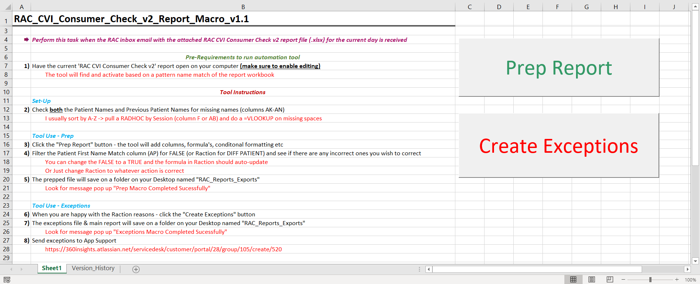
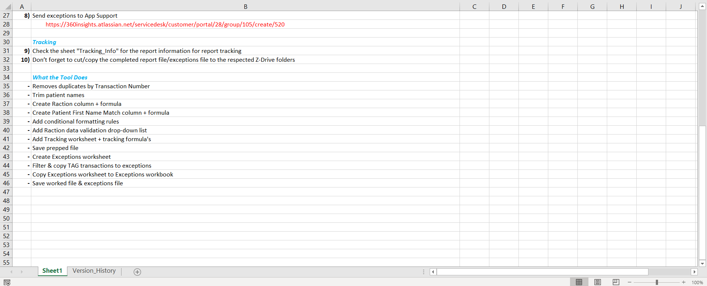

# RAC-CVI-Consumer-Check-v2-Report
Purpose: Identify existing wearers and track them, in case the number of existing wearers claiming for the new wearers bonus ever need to be quantified for the client.

